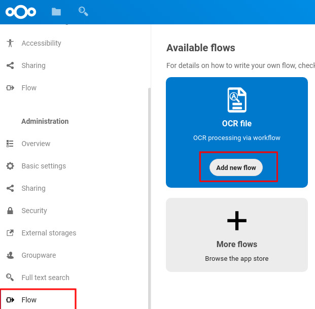
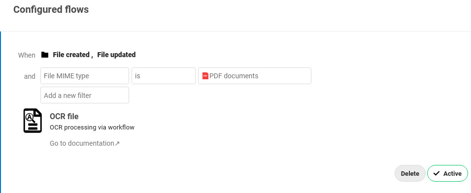
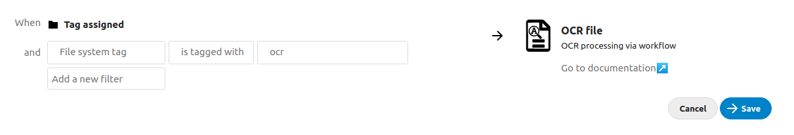
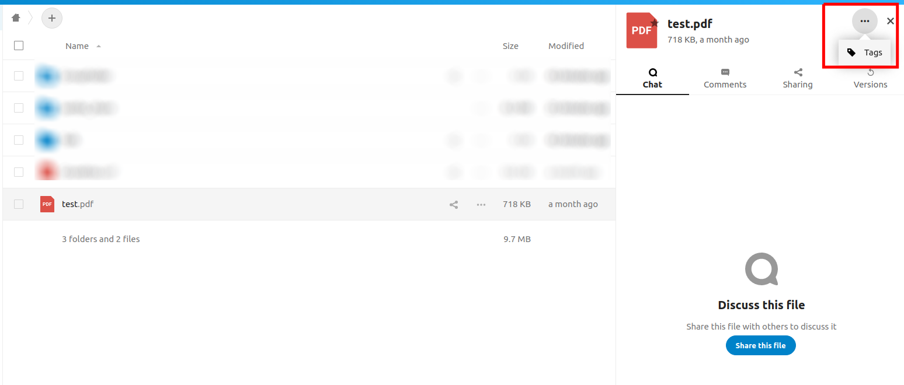
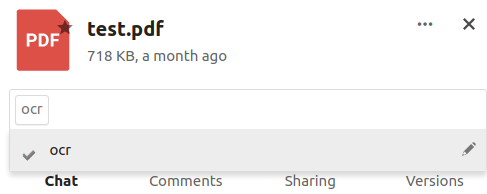
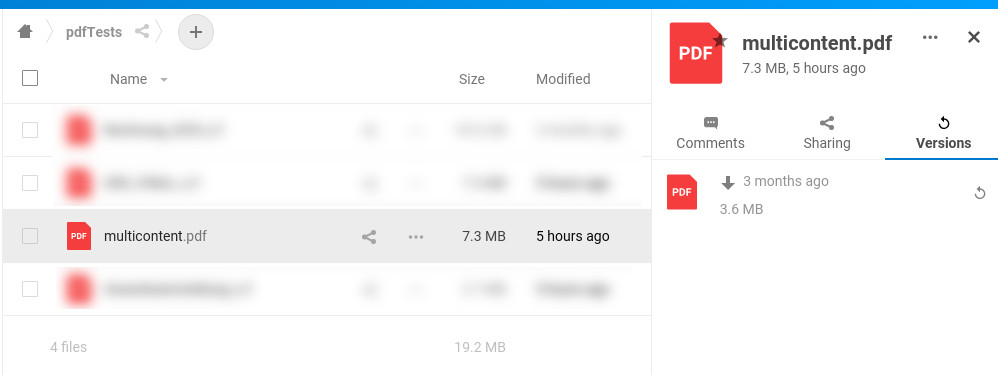
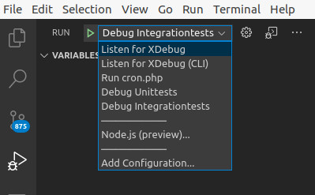

# Nextcloud Workflow OCR app

[](https://codecov.io/gh/R0Wi/workflow_ocr)

[](https://github.com/R0Wi/workflow_ocr/releases)
[](https://github.com/nextcloud/server)

<!-- START doctoc generated TOC please keep comment here to allow auto update -->
<!-- DON'T EDIT THIS SECTION, INSTEAD RE-RUN doctoc TO UPDATE -->
## Table of contents

- [Setup](#setup)
  - [App installation](#app-installation)
  - [Nextcloud background jobs](#nextcloud-background-jobs)
  - [Backend](#backend)
- [Usage](#usage)
  - [Trigger OCR if file was created or updated](#trigger-ocr-if-file-was-created-or-updated)
  - [Trigger OCR on tag assigning](#trigger-ocr-on-tag-assigning)
  - [Testing your configuration](#testing-your-configuration)
- [How it works](#how-it-works)
  - [General](#general)
  - [PDF](#pdf)
- [Development](#development)
  - [Dev setup](#dev-setup)
  - [Debugging](#debugging)
  - [`docker`-based setup](#docker-based-setup)
  - [Executing tests](#executing-tests)
  - [Adding a new `OcrProcessor`](#adding-a-new-ocrprocessor)
- [Limitations](#limitations)
- [Used libraries & components](#used-libraries--components)

<!-- END doctoc generated TOC please keep comment here to allow auto update -->

## Setup
### App installation
First download and install the Nextcloud Workflow OCR app from the official [Nexcloud-appstore](https://apps.nextcloud.com/apps/workflow_ocr) or by downloading the appropriate tarball from the [releases](https://github.com/R0Wi/workflow_ocr/releases) page. 
```bash
cd /var/www/<NEXTCLOUD_INSTALL>/apps
wget https://github.com/R0Wi/workflow_ocr/releases/download/<VERSION>/workflow_ocr.tar.gz
tar -xzvf workflow_ocr.tar.gz
rm workflow_ocr.tar.gz
```
### Nextcloud background jobs
Since the actual processing of the files is done asynchronously via Nextcloud's background job engine, make sure you've properly setup the cron functionallity as described [here](https://docs.nextcloud.com/server/latest/admin_manual/configuration_server/background_jobs_configuration.html#cron-jobs). If possible please use the [`crontab`](https://docs.nextcloud.com/server/latest/admin_manual/configuration_server/background_jobs_configuration.html#cron) approach for more reliability.


### Backend
> :warning: Since `v1.20.1` you'll have to install `OCRmyPDF`.

In the backend [`OCRmyPDF`](https://github.com/jbarlow83/OCRmyPDF) is used for processing PDF files. Make sure you have this commandline tool installed. Make sure you have the appropriate version (see below, Used libraries').  

```bash
apt-get install ocrmypdf
``` 

Also if you want to use specific language settings please install the corresponding `tesseract` packages.

```bash
# English
apt-get install tesseract-ocr-eng

# German
apt-get install tesseract-ocr-deu
```

## Usage
You can configure the OCR processing via Nextcloud's workflow engine. Therefore configure a new flow via `Settings` &#8594; `Flow` &#8594; `Add new flow` (if you don't see `OCR file` here the app isn't installed properly or you forgot to activate it).

<p align="center">
  
</p>

### Trigger OCR if file was created or updated

If you want a newly uploaded file to be processed via OCR or if you want to process a file which was updated, use the **When**-conditions `File created` or `File updated` or both.

A typical setup for processing incoming PDF-files and adding a text-layer to them might look like this:

<p align="center">
  
</p>

> :warning: Please ensure to use the `File MIME type` &#8594; **`is`** &#8594; `PDF documents` operator, otherwise you might not be able to save the workflow like discussed [here](https://github.com/R0Wi/workflow_ocr/issues/41).

### Trigger OCR on tag assigning

If you have existing files which you want to process after they have been created, or if you want to filter manually which files are processed, you can use the `Tag assigned` event to trigger the OCR process if a user adds a specific tag to a file. Such a setup might look like this:

<p align="center">
  
</p>

After that you should be able to add a file to the OCR processing queue by assigning the configured tag to a file:

<p align="center">
  
</p>
<p align="center">
  
</p>

### Testing your configuration

To **test** if your file gets processed properly you can do the following steps:
1. Upload a new file which meets the criteria you've recently defined in the workflow creation.
2. Go to your servers console and change into the Nextcloud installation directory (e.g. `cd /var/www/html/nextcloud`).
3. Execute the cronjob file manually e.g. by typing `sudo -u www-data php cron.php ` (this is the command you usually setup to be executed by linux crontab).
4. If everything went fine you should see that there was a new version of your file created. If you uploaded a PDF file you should now be able to select text in it if it contained at least one image with scanned text.
  <p align="center">
    
  </p>

## How it works
### General
<p align="center">
  
</p>

### PDF
For processing PDF files, the external command line tool [`OCRmyPDF`](https://github.com/jbarlow83/OCRmyPDF) is used. The tool is invoked with the [`--redo-ocr`](https://ocrmypdf.readthedocs.io/en/latest/advanced.html#when-ocr-is-skipped) parameter so that it will perform a detailed text analysis. The detailed analysis masks out visible text and sends the image of each page to the OCR processor. After processing, additional text is inserted as OCR, whereas existing text in a mixed file document (images embedded into text pages) is not disrupted.

## Development
### Dev setup
Tools and packages you need for development:
* `make`
* [`composer`](https://getcomposer.org/download/) (Will be automatically installed when running `make build`)
* Properly setup `php`-environment
* Webserver (like [`Apache`](https://httpd.apache.org/))
* [`XDebug`](https://xdebug.org/docs/install) and a `XDebug`-connector for your IDE (for example https://marketplace.visualstudio.com/items?itemName=felixfbecker.php-debug) if you want to debug PHP code
* PHP IDE (we recommend [`VSCode`](https://code.visualstudio.com/))

You can then build and install the app by cloning this repository into the Nextcloud apps folder and running `make build`.
```bash
cd /var/www/<NEXTCLOUD_INSTALL>/apps
git clone https://github.com/R0Wi/workflow_ocr.git workflow_ocr
cd workflow_ocr
make build
```
Don't forget to activate the app via Nextcloud web-gui.

### Debugging
We provide a preconfigured debug configuration file for `VSCode` at `.vscode/launch.json` which will automatically be recognized when opening this 
repository inside of `VSCode`. If you've properly installed and configured the `XDebug`-plugin you should be able to see it in the upper left corner
when being inside of the debug-tab.

  <p align="center">
    
  </p>

To get the debugger profiles working you need to ensure that `XDebug` for `Apache` (or your preferred webserver) and `XDebug` for PHP CLI both connect to your machine at
port `9003`. Depending on your system a possible configuration could
look like this:

```ini
; /etc/php/7.4/cli/php.ini
; ...
[Xdebug]
zend_extension=/usr/lib/php/20190902/xdebug.so
xdebug.remote_enable=1
xdebug.remote_host=127.0.0.1
xdebug.remote_port=9003
xdebug.remote_autostart=1
```

```ini
; /etc/php/7.4/apache2/php.ini
; ...
[Xdebug]
zend_extension=/usr/lib/php/20190902/xdebug.so
xdebug.remote_enable=1
xdebug.remote_host=127.0.0.1
xdebug.remote_port=9003
xdebug.remote_autostart=1
```

The following table lists the various debug profiles:

| Profile name            | Use                                                                                           |
|-------------------------|-----------------------------------------------------------------------------------------------|
| Listen for XDebug       | Starts XDebug listener for your webserver process.                                            |
| Listen for XDebug (CLI) | Starts XDebug listener for your php cli process.                                              |
| Run cron.php            | Runs Nextcloud's `cron.php` with debugger attached. Useful for debugging OCR-processing jobs. |
| Debug Unittests         | Start PHPUnit Unittests with debugger attached.                                               |
| Debug Integrationtests  | Start PHPUnit Integrationtests with debugger attached.                                        |

If you're looking for some good sources on how to setup `VSCode` + `XDebug` we can recommend:
* https://tighten.co/blog/configure-vscode-to-debug-phpunit-tests-with-xdebug/
* https://code.visualstudio.com/docs/languages/php

### `docker`-based setup
If you're interested in a `docker`-based setup we can recommend
the images from https://github.com/thecodingmachine/docker-images-php which already come with `Apache` and
`XDebug` installed.

A working `docker-compose.yml`-file could look like this:
```yaml
version: '3'
services:
  apache_dev:
    restart: always
    container_name: apache_dev
    image: ${IMAGE}-custom
    build:
      dockerfile: ./Dockerfile
      args:
        IMAGE: ${IMAGE}
    environment:
      - PHP_INI_MEMORY_LIMIT=1g
      - PHP_INI_ERROR_REPORTING=E_ALL
      - PHP_INI_XDEBUG__START_WITH_REQUEST=yes
      - PHP_INI_XDEBUG__LOG_LEVEL=7
      - PHP_EXTENSIONS=xdebug gd intl bcmath gmp imagick
    volumes:
      - ./html:/var/www/html
      - ./000-default.conf:/etc/apache2/sites-enabled/000-default.conf
    ports:
      - 80:80
    networks:
      - web_dev
```
`IMAGE` could be set to `IMAGE=thecodingmachine/php:7.4-v4-apache-node14` and the content of `Dockerfile` might
look like this:

```dockerfile
ARG IMAGE
FROM $IMAGE

USER root
RUN    apt-get update \
    && apt-get install -y make ocrmypdf tesseract-ocr-eng tesseract-ocr-deu smbclient \
    && apt-get clean \
    && rm -rf /var/lib/apt/lists/* /tmp/* /var/tmp/* /usr/share/doc/*
USER docker
```
> :information_source: Please note that these are just
working snippets which you might have to modify to fit
your needs.

### Executing tests
To execute the implemented PHPUnit tests you can use one of the following commands:

```bash
# Only run unittests
make unittest

# Only run integrationtests
make integrationtest

# Run all tests
make test

# Run all tests and create HTML coverage report
make html-coverage

# Run all tests and create XML coverage report
make coverage
```
> :warning: Make sure you activated the app before you run any tests (`php occ app:enable workflow_ocr`). Otherwise the initialization will fail.

### Adding a new `OcrProcessor`
To support a new mimetype for being processed with OCR you have to follow a few easy steps:
1. Create a new class in `lib/OcrProcessors` and let the class implement the interface `IOcrProcessor`.
2. Register your implementation in `lib/OcrProcessors/OcrProcessorFactory.php` by adding it to the mapping.
```php
private static $mapping = [
        'application/pdf' => PdfOcrProcessor::class,
		// Add your class here, for example:
		'mymimetype' => MyOcrProcessor::class
    ];
```
3. Register a factory for creating your newly added processor in `lib/OcrProcessors/OcrProcessorFactory.php` by adding an appropriate function inside of `registerOcrProcessors`.
```php
public static function registerOcrProcessors(IRegistrationContext $context) : void {
		// [...]
		$context->registerService(MyOcrProcessor::class, function(ContainerInterface $c) {
			return new /* your factory goes here */
		}, false);
	}
```

That's all. If you now create a new workflow based on your added mimetype, your implementation should be triggered by the app. The return value of `ocrFile(string $fileContent)` will be interpreted as the file content of the scanned file. This one is used to create a new file version in Nextcloud.

## Limitations
* **Currently only pdf documents (`application/pdf`) can be used as input.** Other mimetypes are currently ignored but might be added in the future.
* Pdf metadata (like author, comments, ...) is not available in the converted output pdf document.
* Currently files are only processed based on workflow-events so there is no batch-mechanism for applying OCR to already existing files. This is a feature which might be added in the future.
* If you encounter any problems with the OCR processing, you can always restore the original file via Nextcloud's version history.
  <p align="center">
    
  </p>
  If you want to clean the files history for all files and only preserve the newest file version, you can use
  
  ```bash
  sudo -u www-data php occ versions:cleanup
  ```
  Read more about this in the [docs](https://docs.nextcloud.com/server/stable/admin_manual/configuration_server/occ_command.html?#versions).

## Used libraries & components
| Name | Version | Link |
|---|---|---|
| OCRmyPDF (commandline) | >= 9.6.0 | https://github.com/jbarlow83/OCRmyPDF On Debian, you might need to manually install a more recent version as described in https://ocrmypdf.readthedocs.io/en/latest/installation.html#ubuntu-18-04-lts; see https://github.com/R0Wi/workflow_ocr/issues/46 |
| php-shellcommand | >= 1.6 | https://github.com/mikehaertl/php-shellcommand |
| PHPUnit | >= 8.0 | https://phpunit.de/ |
