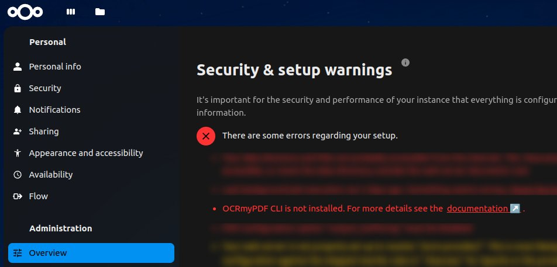
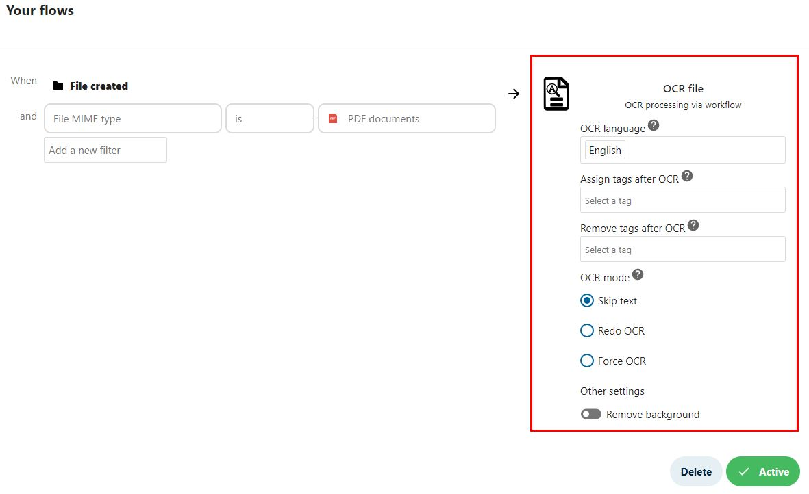
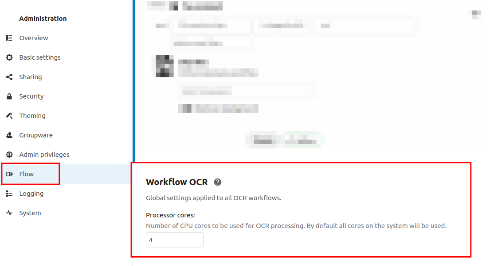
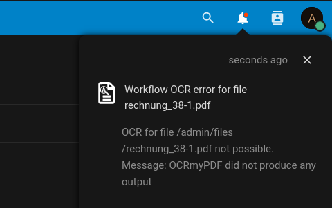
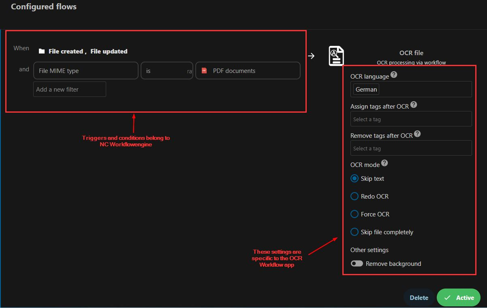

# Nextcloud Workflow OCR app

[](https://sonarcloud.io/summary/new_code?id=R0Wi_workflow_ocr)
[](https://sonarcloud.io/summary/new_code?id=R0Wi_workflow_ocr)

[](https://github.com/R0Wi/workflow_ocr/releases)
[](https://github.com/nextcloud/server)

[](https://www.buymeacoffee.com/R0Wi)

## Table of contents

- [Nextcloud Workflow OCR app](#nextcloud-workflow-ocr-app)
  - [Table of contents](#table-of-contents)
  - [Setup](#setup)
    - [App installation](#app-installation)
    - [Nextcloud background jobs](#nextcloud-background-jobs)
    - [Backend](#backend)
      - [Local installation](#local-installation)
      - [`workflow_ocr_backend` installation](#workflow_ocr_backend-installation)
    - [Setup Checks](#setup-checks)
  - [Usage](#usage)
    - [Useful triggers](#useful-triggers)
      - [Trigger OCR if file was created or updated](#trigger-ocr-if-file-was-created-or-updated)
      - [Trigger OCR on tag assigning](#trigger-ocr-on-tag-assigning)
    - [Settings](#settings)
      - [Per workflow settings](#per-workflow-settings)
      - [Global settings](#global-settings)
    - [Testing your configuration](#testing-your-configuration)
    - [Get feedback via Notifications](#get-feedback-via-notifications)
  - [How it works](#how-it-works)
    - [General](#general)
    - [PDF](#pdf)
    - [Images](#images)
  - [Troubleshooting](#troubleshooting)
    - [Generic troubleshooting guide](#generic-troubleshooting-guide)
    - [The Nextcloud Workflowengine](#the-nextcloud-workflowengine)
  - [Development](#development)
    - [Dev setup](#dev-setup)
    - [Debugging](#debugging)
    - [`docker`-based setup](#docker-based-setup)
    - [Executing tests](#executing-tests)
    - [Adding a new `OcrProcessor`](#adding-a-new-ocrprocessor)
    - [Events emitted by the app](#events-emitted-by-the-app)
      - [`TextRecognizedEvent`](#textrecognizedevent)
  - [Limitations](#limitations)
  - [Used libraries \& components](#used-libraries--components)

## Setup
### App installation
First download and install the Nextcloud Workflow OCR app from the official [Nexcloud-appstore](https://apps.nextcloud.com/apps/workflow_ocr) or by downloading the appropriate tarball from the [releases](https://github.com/R0Wi/workflow_ocr/releases) page. 
```bash
cd /var/www/<NEXTCLOUD_INSTALL>/apps
wget https://github.com/R0Wi/workflow_ocr/releases/download/<VERSION>/workflow_ocr.tar.gz
tar -xzvf workflow_ocr.tar.gz
rm workflow_ocr.tar.gz
```
### Nextcloud background jobs
Since the actual processing of the files is done asynchronously via Nextcloud's background job engine, make sure you've properly setup the cron functionallity as described [here](https://docs.nextcloud.com/server/latest/admin_manual/configuration_server/background_jobs_configuration.html#cron-jobs). If possible please use the [`crontab`](https://docs.nextcloud.com/server/latest/admin_manual/configuration_server/background_jobs_configuration.html#cron) approach for more reliability.


### Backend

This app is based on `ocrmypdf`. You can either install the CLI directly on the server running Nextcloud or use the alternative backend setup via Docker.

#### Local installation

> :warning: Since `v1.20.1` you'll have to install `OCRmyPDF`.

In the backend [`OCRmyPDF`](https://github.com/jbarlow83/OCRmyPDF) is used for processing PDF files. Make sure you have this commandline tool installed. Make sure you have the appropriate version (see below, Used libraries').

```bash
apt-get install ocrmypdf
``` 

The `ocrmypdf` CLI can also convert single image files (`jpg`/`png`) to PDF before processing it via OCR. This mode is also supported by this app. You can read more about it in the [official docs](https://ocrmypdf.readthedocs.io/en/latest/cookbook.html#option-use-ocrmypdf-single-images-only).

Also if you want to use specific **language settings** please [install the corresponding `tesseract` packages](https://ocrmypdf.readthedocs.io/en/latest/languages.html).

```bash
# English
apt-get install tesseract-ocr-eng

# German
apt-get install tesseract-ocr-deu

# Chinese - Simplified
apt-get install tesseract-ocr-chi-sim
```

#### `workflow_ocr_backend` installation

Starting from version 30, Nextcloud added support for [AppApi](https://docs.nextcloud.com/server/latest/admin_manual/exapps_management/AppAPIAndExternalApps.html) apps. In essence this allows external container based applications to be integrated into the Nextcloud ecosystem. This app is using this feature to provide an alternative backend setup via Docker.

If everything is setup properly, you can just install the `workflow_ocr_backend` app from the [appstore](hhttps://apps.nextcloud.com/apps/workflow_ocr_backend).

Please refer to **https://github.com/R0Wi-DEV/workflow_ocr_backend** for more information on how to setup the backend.

> :information_source: If the `workflow_ocr_backend` External App is installed, this "frontend" app will automatically use it as the backend even if you installed `ocrmypdf` locally.

### Setup Checks

The app will perform some [Setup Checks](https://docs.nextcloud.com/server/latest/admin_manual/configuration_server/security_setup_warnings.html) to verify your installation. If there is any problem with your backend setup, you'll see an error printed in Nextcloud under `Administration Settings` &#8594; `Overview` &#8594; `Security & setup warnings`.

<p align="center">
  
</p>

## Usage
You can configure the OCR processing via Nextcloud's workflow engine. Therefore configure a new flow via `Settings` &#8594; `Flow` &#8594; `Add new flow` (if you don't see `OCR file` here the app isn't installed properly or you forgot to activate it).

<p align="center">
  
</p>

### Useful triggers

#### Trigger OCR if file was created or updated

If you want a newly uploaded file to be processed via OCR or if you want to process a file which was updated, use the **When**-conditions `File created` or `File updated` or both.

A typical setup for processing incoming PDF-files and adding a text-layer to them might look like this:

<p align="center">
  
</p>

> :warning: Please ensure to use the `File MIME type` &#8594; **`is`** &#8594; `PDF documents` operator, otherwise you might not be able to save the workflow like discussed [here](https://github.com/R0Wi/workflow_ocr/issues/41).

#### Trigger OCR on tag assigning

If you have existing files which you want to process after they have been created, or if you want to filter manually which files are processed, you can use the `Tag assigned` event to trigger the OCR process if a user adds a specific tag to a file. Such a setup might look like this:

<p align="center">
  
</p>

After that you should be able to add a file to the OCR processing queue by assigning the configured tag to a file:

<p align="center">
  
</p>
<p align="center">
  
</p>

### Settings

#### Per workflow settings
Anyone who can create new workflows (admin or regular user) can configure settings for the OCR processing for a specific workflow. These settings are only applied to the specific workflow and do not affect other workflows.

<p align="center">
  
</p>

Currently the following settings are available per workflow:

Name | Description
--- | ---
OCR language | The languages to be used for OCR processing. The languages can be choosen from a dropdown list. For PDF files this setting corresponds to the `-l` parameter of `ocrmypdf`. **Please note** that you'll have to install the appropriate languages like described in the [`ocrmypdf` documentation](https://ocrmypdf.readthedocs.io/en/latest/languages.html).
Assign tags after OCR | These tags will be assigned to the file after it has been successfully processed. |
Remove tags after OCR | These tags will be removed from the file after it has been successfully processed. If the file does not have the tag, it will just be skipped. |
OCR mode | Controls the way files are processed, which already have OCR content. For PDF files this setting corresponds to the `--skip-text`, `--redo-ocr` and `--force-ocr` parameters of `ocrmypdf`. See [official docs](https://ocrmypdf.readthedocs.io/en/latest/advanced.html#when-ocr-is-skipped) for additional information.<br>**Skip text:** skip pages completely that already contain text. Such a page will not be touched and just be copied to the final output.<br>**Redo OCR:** perform a detailed text analysis to split up pages into areas with and without text.<br>**Force OCR:** all pages will be rasterized to images and OCR will be performed on every page. |
Keep original file version | If the switch is set, the original file (before applying OCR) will be kept. This is done by giving the file version the label `Before OC`. This version will be excluded from the automatic expiration process (see [here](https://docs.nextcloud.com/server/latest/user_manual/en/files/version_control.html#naming-a-version) for details) |
Keep original file modification date | Restore the modification date of the original file. The original modification date will be applied to the newly created file version. This is useful if you need to preserve the file modification date, for example to be able to sort files accordingly. |	
Send success notification | Usually the workflow would only send a notification to the user if the OCR process failed. If this option is activated, the user will also be notified if a document has been processed successfully via OCR. |
Remove background\* | If the switch is set, the OCR processor will try to remove the background of the document before processing and instead set a white background. For PDF files this setting corresponds to the [`--remove-background`](https://ocrmypdf.readthedocs.io/en/latest/cookbook.html?highlight=remove-background#image-processing) parameter of `ocrmypdf`.<br/>:warning: Please note that this flag will currently only work with **`ocrmypdf` versions prior to 13**. It might be added in future versions again. See [here](https://github.com/ocrmypdf/OCRmyPDF/issues/884) for details. :warning:|
Custom ocrMyPdf CLI arguments | If you want to pass custom arguments to the `ocrmypdf` CLI, you can do so here. Please note that the arguments will be passed as they are to the CLI, so make sure to use the correct syntax. Check the [official docs](https://ocrmypdf.readthedocs.io/en/latest/cookbook.html) for more information. |


\* *For `ocrmypdf` the parameter `--remove-background` is [incompatible with `--redo-ocr`](https://github.com/ocrmypdf/OCRmyPDF/blob/110c75cba25121dcca7e2b91644206cce29e8430/src/ocrmypdf/_validation.py#L104).*

#### Global settings
As a Nextcloud administrator you're able to configure global settings which apply to all configured OCR-workflows on the current system.
Go to `Settings` &#8594; `Flow` and scroll down to `Workflow OCR`:

<p align="center">
  
</p>

Currently the following settings can be applied globally:

Name | Description
-----|------------
Processor cores | Defines the number of processor cores to use for OCR processing. When the input is a PDF file, this corresponds to the [`ocrmypdf` CPU limit](https://ocrmypdf.readthedocs.io/en/latest/pdfsecurity.html?highlight=%22-j%22#limiting-cpu-usage). This setting can be especially useful if you have a small backend system which has only limited power.

### Testing your configuration

To **test** if your file gets processed properly you can do the following steps:
1. Upload a new file which meets the criteria you've recently defined in the workflow creation.
2. Go to your servers console and change into the Nextcloud installation directory (e.g. `cd /var/www/html/nextcloud`).
3. Execute the cronjob file manually e.g. by typing `sudo -u www-data php cron.php ` (this is the command you usually setup to be executed by linux crontab).
4. If everything went fine you should see that there was a new version of your file created. If you uploaded a PDF file you should now be able to select text in it if it contained at least one image with scanned text.
  <p align="center">
    
  </p>

### Get feedback via Notifications

The Workflow OCR app supports sending notifications to the user in case anything went wrong during the [asynchronous OCR processing](#how-it-works). To enable this feature, you have to install and enable the [`Notifications`](https://github.com/nextcloud/notifications) app in your Nextcloud instance.

<p align="center">
  
</p>


## How it works
### General
<p align="center">
  
</p>

### PDF
For processing PDF files, the external command line tool [`OCRmyPDF`](https://github.com/jbarlow83/OCRmyPDF) is used. The tool is always invoked with the [`--skip-text`](https://ocrmypdf.readthedocs.io/en/latest/advanced.html#when-ocr-is-skipped) parameter so that it will skip pages which already contain text. Please note that with that parameter set, it's currently not possible to analize pages with mixed content (see https://github.com/R0Wi/workflow_ocr/issues/113 for furhter information).

### Images
For processing single images (currently `jpg` and `png` are supported), `ocrmypdf` converts the image to a PDF. The converted PDF file will then be OCR processed and saved as a new file with the original filename and the extension `.pdf` (for example `myImage.jpg` will be saved to `myImage.jpg.pdf`). The original image fill will remain untouched.

## Troubleshooting

### Generic troubleshooting guide

Since this app does its main work asynchronously, controlled by the NC cron, the troubleshooting gets slightly more complicated. That's why we suggest to follow this guide if you're facing any issues:

1. Create your OCR workflow with triggers and conditions to your taste
2. Temporarily decrease the servers [loglevel](https://docs.nextcloud.com/server/latest/admin_manual/configuration_server/logging_configuration.html#log-level) to `0`
3. Try to trigger the workflow according to the conditions you've set (for example by uploading a new PDF file or setting a new tag)
4. Check your Database table `oc_jobs`. This should contain a new job for the OCR processing like this: `| OCA\WorkflowOcr\BackgroundJobs\ProcessFileJob | {"filePath":"some.pdf","settings":"{\"languages\":[\"eng\"]}"}`. If that's not the case, you can stop here. You're facing a condition issue. The `nextcloud.log` file content might help you to find out why your workflow was not added to the queue
5. If you can see a new job for the OCR process, run the [cron.php](https://docs.nextcloud.com/server/latest/admin_manual/configuration_server/background_jobs_configuration.html#cron) once manually (for example by running `sudo -u www-data php -f /var/www/nextcloud/cron.php`)
6. Inspect your `nextcloud.log` file (e.g. by using the [logreader](https://github.com/nextcloud/logreader)). You should be able to see various outputs, pointing you to the right direction (for example you should be able to see the output of the `ocrmypdf` process)

### The Nextcloud Workflowengine

This app is build on top of the [Nextcloud Workflowengine](https://nextcloud.com/de/workflow/) which makes it quite flexible and customizable. But this comes with the tradeoff that some missbehaviours might be related to the app itself and some others have their origin in the Workflowengine. As a rule of thumb, everything related to the lefhandside triggers and conditions secions comes from the NC Workflowengine, while the settings on the righthandside are OCR app specific:

  <p align="center">
    
  </p>

Please keep that in mind when troubleshooting issues. Of course, feel free to open new issues here, but we might need to redirect you to the [official NC Server project](https://github.com/nextcloud/server).

You can check issues related to the Workflowengine by trying to reproduce the same behaviour with different [workflow-based apps](https://apps.nextcloud.com/categories/workflow). If they behave in the same way in terms of triggers and conditions, the issue is most likely related to the NC Workflowengine itself and cannot be fixed here.
## Development

### Dev setup
Tools and packages you need for development:
* `make`
* `node` and `npm`
* [`composer`](https://getcomposer.org/download/) (Will be automatically installed when running `make build`)
* Properly setup `php`-environment
* Webserver (like [`Apache`](https://httpd.apache.org/))
* [`XDebug`](https://xdebug.org/docs/install) and a `XDebug`-connector for your IDE (for example https://marketplace.visualstudio.com/items?itemName=felixfbecker.php-debug) if you want to debug PHP code
* PHP IDE (we recommend [`VSCode`](https://code.visualstudio.com/))

You can then build and install the app by cloning this repository into the Nextcloud apps folder and running `make build`.
```bash
cd /var/www/<NEXTCLOUD_INSTALL>/apps
git clone https://github.com/R0Wi/workflow_ocr.git workflow_ocr
cd workflow_ocr
make build
```
Don't forget to activate the app via Nextcloud web-gui.

### Debugging
We provide a preconfigured debug configuration file for `VSCode` at `.vscode/launch.json` which will automatically be recognized when opening this 
repository inside of `VSCode`. If you've properly installed and configured the `XDebug`-plugin you should be able to see it in the upper left corner
when being inside of the debug-tab.

  <p align="center">
    
  </p>

To get the debugger profiles working you need to ensure that `XDebug` for `Apache` (or your preferred webserver) and `XDebug` for PHP CLI both connect to your machine at
port `9003`. Depending on your system a possible configuration could
look like this:

```ini
; /etc/php/8.1/cli/php.ini
; ...
[Xdebug]
zend_extension=/usr/lib/php/20190902/xdebug.so
xdebug.remote_enable=1
xdebug.remote_host=127.0.0.1
xdebug.remote_port=9003
xdebug.remote_autostart=1
```

```ini
; /etc/php/8.1/apache2/php.ini
; ...
[Xdebug]
zend_extension=/usr/lib/php/20190902/xdebug.so
xdebug.remote_enable=1
xdebug.remote_host=127.0.0.1
xdebug.remote_port=9003
xdebug.remote_autostart=1
```

The following table lists the various debug profiles:

| Profile name            | Use                                                                                           |
|-------------------------|-----------------------------------------------------------------------------------------------|
| Listen for XDebug       | Starts XDebug listener for your webserver process.                                            |
| Listen for XDebug (CLI) | Starts XDebug listener for your php cli process.                                              |
| Run cron.php            | Runs Nextcloud's `cron.php` with debugger attached. Useful for debugging OCR-processing jobs. |
| Debug Unittests         | Start PHPUnit Unittests with debugger attached.                                               |
| Debug Integrationtests  | Start PHPUnit Integrationtests with debugger attached.                                        |

If you're looking for some good sources on how to setup `VSCode` + `XDebug` we can recommend:
* https://tighten.co/blog/configure-vscode-to-debug-phpunit-tests-with-xdebug/
* https://code.visualstudio.com/docs/languages/php

### `docker`-based setup
If you're interested in a `docker`-based setup we can recommend
the images from https://github.com/thecodingmachine/docker-images-php which already come with `Apache` and
`XDebug` installed.

A working `docker-compose.yml`-file could look like this:
```yaml
version: '3'
services:
  apache_dev:
    restart: always
    container_name: apache_dev
    image: ${IMAGE}-custom
    build:
      dockerfile: ./Dockerfile
      args:
        IMAGE: ${IMAGE}
    environment:
      - PHP_INI_MEMORY_LIMIT=1g
      - PHP_INI_ERROR_REPORTING=E_ALL
      - PHP_INI_XDEBUG__START_WITH_REQUEST=yes
      - PHP_INI_XDEBUG__LOG_LEVEL=7
      - PHP_EXTENSIONS=xdebug gd intl bcmath gmp imagick
    volumes:
      - ./html:/var/www/html
      - ./000-default.conf:/etc/apache2/sites-enabled/000-default.conf
    ports:
      - 80:80
    networks:
      - web_dev
```
`IMAGE` could be set to `IMAGE=thecodingmachine/php:8.1-v4-apache-node14` and the content of `Dockerfile` might
look like this:

```dockerfile
ARG IMAGE
FROM $IMAGE

USER root
RUN    apt-get update \
    && apt-get install -y make ocrmypdf tesseract-ocr-eng tesseract-ocr-deu smbclient \
    && apt-get clean \
    && rm -rf /var/lib/apt/lists/* /tmp/* /var/tmp/* /usr/share/doc/*
USER docker
```
> :information_source: Please note that these are just
working snippets which you might have to modify to fit
your needs.

### Executing tests
To execute the implemented PHPUnit tests you can use one of the following commands:

```bash
# Only run unittests
make unittest

# Only run integrationtests
make integrationtest

# Run all tests
make test

# Run all tests and create HTML coverage report
make html-coverage

# Run all tests and create XML coverage report
make coverage
```
> :warning: Make sure you activated the app before you run any tests (`php occ app:enable workflow_ocr`). Otherwise the initialization will fail.

### Adding a new `OcrProcessor`
To support a new mimetype for being processed with OCR you have to follow a few easy steps:
1. Create a new class in `lib/OcrProcessors` and let the class implement the interface `IOcrProcessor`.
2. Register your implementation in `lib/OcrProcessors/OcrProcessorFactory.php` by adding it to the mapping.
```php
private static $mapping = [
        'application/pdf' => PdfOcrProcessor::class,
		// Add your class here, for example:
		'mymimetype' => MyOcrProcessor::class
    ];
```
3. Register a factory for creating your newly added processor in `lib/OcrProcessors/OcrProcessorFactory.php` by adding an appropriate function inside of `registerOcrProcessors`.
```php
public static function registerOcrProcessors(IRegistrationContext $context) : void {
		// [...]
		$context->registerService(MyOcrProcessor::class, function(ContainerInterface $c) {
			return new /* your factory goes here */
		}, false);
	}
```

That's all. If you now create a new workflow based on your added mimetype, your implementation should be triggered by the app. The return value of `ocrFile(string $fileContent, WorkflowSettings $settings, GlobalSettings $globalSettings)` will be interpreted as the file content of the scanned file. This one is used to create a new file version in Nextcloud.

### Events emitted by the app

The app currently emits the following events from `lib/Events`. You can use these hooks to extend the app's functionality inside your own app.
Use the following sample code to implement  a listener for the events:

```php
use OCA\WorkflowOcr\Events\TextRecognizedEvent;
use OCP\EventDispatcher\Event;
use OCP\EventDispatcher\IEventListener;

class TextRecognizedListener implements IEventListener {
	public function handle(Event $event): void {
		if (!$event instanceof TextRecognizedEvent) {
			return;
		}
		// Do something with the event ...
	}
}
```

Your implementation should then be registered in your app's `Application.php`:

```php
public function register(IRegistrationContext $context): void {
		$context->registerEventListener(TextRecognizedEvent::class, TextRecognizedListener::class);
}
```

#### `TextRecognizedEvent`

This event will be emitted when a OCR process has finished successfully. It contains the following information:

| Method | Type | Description |
|--------|-------|------------|
| `getRecognizedText()` | `string` | Contains the text which was recognized by the OCR process. |
| `getFile()`   | `OCP\Files\File` | The NC file node where the OCR processed file was stored to. |

> **Note:** this event will be emitted even if the OCR content was empty.

## Limitations
* **Currently only pdf documents (`application/pdf`) and single images (`image/jpeg` and `image/png`) can be used as input.** Other mimetypes are currently ignored but might be added in the future.
* All input file types currently produce a single `pdf` output file. Currently there is no other output file format supported.
* Pdf metadata (like author, comments, ...) might not be available in the converted output pdf document. This is limited by the capabilities of `ocrmypdf` (see https://github.com/ocrmypdf/OCRmyPDF/issues/327).
* Currently files are only processed based on workflow-events so there is no batch-mechanism for applying OCR to already existing files. This is a feature which might be added in the future. For applying OCR to a single file, which already exist, one could use the ["tag assigned"](#trigger-ocr-on-tag-assigning) workflow trigger.
* If you encounter any problems with the OCR processing, you can always restore the original file via Nextcloud's version history.
  <p align="center">
    
  </p>
  If you want to clean the files history for all files and only preserve the newest file version, you can use
  
  ```bash
  sudo -u www-data php occ versions:cleanup
  ```
  Read more about this in the [docs](https://docs.nextcloud.com/server/stable/admin_manual/configuration_server/occ_command.html?#versions).

## Used libraries & components
| Name | Version | Link |
|---|---|---|
| OCRmyPDF (commandline) | >= 9.6.0 | https://github.com/jbarlow83/OCRmyPDF On Debian, you might need to manually install a more recent version as described in https://ocrmypdf.readthedocs.io/en/latest/installation.html#ubuntu-18-04-lts; see https://github.com/R0Wi/workflow_ocr/issues/46 |
| php-shellcommand | >= 1.6 | https://github.com/mikehaertl/php-shellcommand |
| chain | >= 0.9.0 | https://packagist.org/packages/cocur/chain |
| PHPUnit | >= 8.0 | https://phpunit.de/ |
