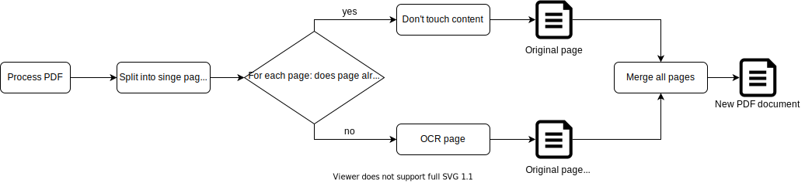

# Nextcloud Workflow OCR app

[](https://codecov.io/gh/R0Wi/workflow_ocr)

[](https://github.com/R0Wi/workflow_ocr/releases)
[](https://github.com/nextcloud/server)

## Table of contents
* [Setup](#setup)
    + [App installation](#app-installation)
    + [Nextcloud background jobs](#nextcloud-background-jobs)
    + [Backend](#backend)
      - [Imagick](#imagick)
      - [Tesseract](#tesseract)
  * [Usage](#usage)
  * [How it works](#how-it-works)
    + [General](#general)
    + [PDF](#pdf)
  * [Development](#development)
    + [Dev setup](#dev-setup)
    + [Debugging](#debugging)
    + [Adding a new `OcrProcessor`](#adding-a-new--ocrprocessor-)
  * [Limitations](#limitations)
  * [Used libraries & components](#used-libraries---components)

## Setup
### App installation
First download and install the Nextcloud Workflow OCR app from the official Nexcloud-appstore or by downloading the appropriate tarball from the [releases](https://github.com/R0Wi/workflow_ocr/releases) page. 
```bash
cd /var/www/<NEXTCLOUD_INSTALL>/apps
wget https://github.com/R0Wi/workflow_ocr/releases/download/<VERSION>/workflow_ocr.tar.gz
tar -xzvf workflow_ocr.tar.gz
rm workflow_ocr.tar.gz
```
### Nextcloud background jobs
Since the actual processing of the files is done asynchronously via Nextcloud's background job engine, make sure you've properly setup the cron functionallity as described [here](https://docs.nextcloud.com/server/latest/admin_manual/configuration_server/background_jobs_configuration.html#cron-jobs). If possible please use the [`crontab`](https://docs.nextcloud.com/server/latest/admin_manual/configuration_server/background_jobs_configuration.html#cron) approach for more reliability.


### Backend
#### Imagick
Make sure `Imagick` is installed (the command below is for debian based Linux systems. It might be different on your system.).
```bash
sudo apt-get install php-imagick
```

Make sure `Imagick` is properly configured so that it can access pdf files. On debian based systems edit the configuration file `/etc/ImageMagick-6/policy.xml` (path might be different on your system). It has to contain at least this line:
```xml
<policymap>
  <!-- [...] -->
  <policy domain="coder" rights="read" pattern="PDF" />
  <!-- [...] -->
</policymap>

```
If you use **any other background job setting than [`cron`](https://docs.nextcloud.com/server/latest/admin_manual/configuration_server/background_jobs_configuration.html#cron)** you'll have to restart your php environment for the above changes to be applied. Depending on your system this is usually done by restarting your `php-fpm`-daemon or webserver, for example:

```bash
# Restart php-fpm
sudo systemctl restart php7.3-fpm.service

# Restart Apache webserver
sudo systemctl restart apache2
```

You can find additional information about `Imagick` [here](https://www.php.net/manual/en/imagick.setup.php).

> :warning: **Note that `Imagick` requires [Ghostscript](https://www.ghostscript.com) to properly read PDF files. You can find more details in the section [Supported Image Formats](https://imagemagick.org/script/formats.php#supported) of `Imagick`'s documentation.**

#### Tesseract
For the OCR part the commandlinetool `tesseract` is used. Make sure you have the library and appropriate languages installed. I recommend installing the packages from [PPA](https://github.com/tesseract-ocr/tessdoc/blob/master/Home.md) because they're newer than the official package-sources (i tested with `tesseract 4.1.1`). On Ubuntu 18.04 you might type the following for languages english and german:
```bash
# Install PPA
sudo add-apt-repository ppa:alex-p/tesseract-ocr
sudo apt-get update

# Install Tesseract and language-files
sudo apt-get install tesseract-ocr tesseract-ocr-deu tesseract-ocr-eng
```
You can read more about the installation of `tesseract` [here](https://github.com/tesseract-ocr/tesseract/wiki).

## Usage
You can configure the OCR processing via Nextcloud's workflow engine. Therefore configure a new flow via `Settings -> Flow -> Add new flow` (if you don't see `OCR file` here the app isn't installed properly or you forgot to activate it).

<p align="center">
  
</p>

A typical setup for processing incoming PDF-files and adding a text-layer to them might look like this:

<p align="center">
  
</p>

Note that currently only the events `File created` and `File updated` are supported. Other events will be ignored since they don't really make sense regarding the OCR-process.

To **test** if your file gets processed properly you can do the following steps:
1. Upload a new file which meets the criteria you've recently defined in the workflow creation.
2. Go to your servers console and change into the Nextcloud installation directory (e.g. `cd /var/www/html/nextcloud`).
3. Execute the cronjob file manually e.g. by typing `sudo -u www-data php cron.php ` (this is the command you usually setup to be executed by linux crontab).
4. If everything went fine you should see that there was a new version of your file created. If you uploaded a PDF file you should now be able to select text in it if it contained at least one image with scanned text.

## How it works
### General
<p align="center">
  
</p>

### PDF
<p align="center">
  
</p>

**Note on PDF processing:** since the processing algorithm for PDF files makes heavy use of splitting an recombining the single PDF pages, it could damage certain PDF files or manipulate the content somehow. 

## Development
### Dev setup
Tools and packages you need for development:
* `make`
* [`composer`](https://getcomposer.org/download/) (Will be automatically installed when running `make build`)
* Properly setup `php`-environment
* Webserver (like [`Apache`](https://httpd.apache.org/))
* [`XDebug`](https://xdebug.org/docs/install) and a `XDebug`-connector for your IDE (for example https://marketplace.visualstudio.com/items?itemName=felixfbecker.php-debug) if you want to debug PHP code
* PHP IDE (we recommend [`VSCode`](https://code.visualstudio.com/))

You can then build and install the app by cloning this repository into the Nextcloud apps folder and running `make build`.
```bash
cd /var/www/<NEXTCLOUD_INSTALL>/apps
git clone https://github.com/R0Wi/workflow_ocr.git workflow_ocr
cd workflow_ocr
make build
```
Don't forget to activate the app via Nextcloud web-gui.

### Debugging
We provide a preconfigured debug configuration file for `VSCode` at `.vscode/launch.json` which will automatically be recognized when opening this 
repository inside of `VSCode`. If you've properly installed and configured the `XDebug`-plugin you should be able to see it in the upper left corner
when being inside of the debug-tab.

  <p align="center">
    
  </p>

To get the debugger profiles working you need to ensure that `XDebug` for `Apache` (or your preferred webserver) is connected to you machine at
port `9000` while `XDebug` for the PHP CLI should be configured to bind to port `9001`. Depending on your system a possible configuration could
look like this:

```ini
; /etc/php/7.4/cli/php.ini
; ...
[Xdebug]
zend_extension=/usr/lib/php/20190902/xdebug.so
xdebug.remote_enable=1
xdebug.remote_host=127.0.0.1
xdebug.remote_port=9001
xdebug.remote_autostart=1
```

```ini
; /etc/php/7.4/apache2/php.ini
; ...
[Xdebug]
zend_extension=/usr/lib/php/20190902/xdebug.so
xdebug.remote_enable=1
xdebug.remote_host=127.0.0.1
xdebug.remote_port=9000
xdebug.remote_autostart=1
```

The following table lists the various debug profiles:

| Profile name            | Use                                                                                           |
|-------------------------|-----------------------------------------------------------------------------------------------|
| Listen for XDebug       | Starts XDebug listener for your webserver process.                                            |
| Listen for XDebug (CLI) | Starts XDebug listener for your php cli process.                                              |
| Run cron.php            | Runs Nextcloud's `cron.php` with debugger attached. Useful for debugging OCR-processing jobs. |
| Debug Unittests         | Start PHPUnit Unittests with debugger attached.                                               |
| Debug Integrationtests  | Start PHPUnit Integrationtests with debugger attached.                                        |

If you're looking for some good sources on how to setup `VSCode` + `XDebug` we can recommend:
* https://tighten.co/blog/configure-vscode-to-debug-phpunit-tests-with-xdebug/
* https://code.visualstudio.com/docs/languages/php

### Adding a new `OcrProcessor`
To support a new mimetype for being processed with OCR you have to follow a few easy steps:
1. Create a new class in `lib/OcrProcessors` and let the class implement the interface `IOcrProcessor`.
2. Register your implementation in `lib/OcrProcessors/OcrProcessorFactory.php` by adding it to the mapping.
```php
private static $mapping = [
        'application/pdf' => PdfOcrProcessor::class,
        // Add your class here
    ];
```
That's all. If you now create a new workflow based on your added mimetype, your implementation should be triggered by the app. The return value of `ocrFile(string $fileContent)` will be interpreted as the file content of the scanned file. This one is used to create a new file version in Nextcloud.

## Limitations
* **Currently only pdf documents (`application/pdf`) can be used as input.** Other mimetypes are currently ignored but might be added in the future.
* Pdf metadata (like author, comments, ...) is not available in the converted output pdf document.
* Currently files are only processed based on workflow-events so there is no batch-mechanism for applying OCR to already existing files. This is a feature which might be added in the future.
* If you encounter any problems with the OCR processing, you can always restore the original file via Nextcloud's version history.
  <p align="center">
    
  </p>

## Used libraries & components
| Name | Version | Link |
|---|---|---|
| tesseract_ocr | >= 2.9 | https://github.com/thiagoalessio/tesseract-ocr-for-php |
| tesseract (commandline) | >= 4.0 | https://github.com/tesseract-ocr/tesseract |
| pdfparser | >= 0.15.0 | https://www.pdfparser.org/ |
| fpdi | >= 2.3 | https://www.setasign.com/products/fpdi/about/ |
| fpdf | >= 1.8 | http://www.fpdf.org/ |
| imagick php extension | >= 2 | https://www.php.net/manual/de/book.imagick.php |
| Ghostscript | >= 9.0 | https://www.ghostscript.com/ |
| PHPUnit | >= 8.0 | https://phpunit.de/ |
